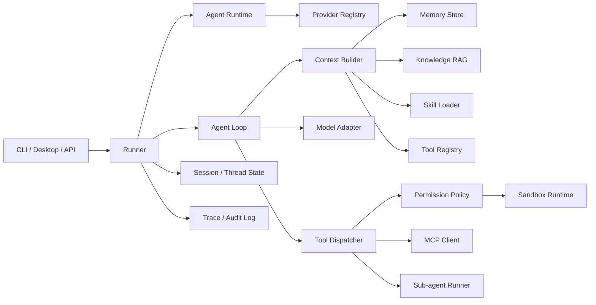

# AI Agent Framework Design

目标：参考 Codex / Claude Code / OpenAI Agents SDK 的思想，设计一个用于学习和实践的 AI agent 框架。这个框架不追求一开始就做成生产级平台，而是把 agent runtime、sandbox、memory、knowledge RAG、MCP、skill、agent loop、agent harness 的核心机制拆清楚，并能逐步实现。

## 1. 设计原则

1. Agent loop 和 execution harness 分离。
   - Agent loop 负责上下文组装、模型调用、工具选择、结果解释、终止判断。
   - Harness 负责文件系统、shell、补丁、权限、审批、进程、工作区、日志、状态恢复。

2. 能力都走统一协议。
   - 本地函数工具、shell、文件、RAG、MCP 工具、子 agent、skills，都归一成 `ToolSpec -> ToolCall -> ToolResult`。
   - 模型看到的是工具 schema 和描述；runtime 看到的是权限、超时、审计和错误处理。

3. 所有能力都是可插拔 provider。
   - model、memory、RAG、MCP、skills、sandbox、trace、tool provider 都不能写死在 loop 里。
   - 用户通过配置选择 provider，例如 `model=aws-bedrock`、`model=volcengine-ark`、`memory=local-sqlite`、`memory=aws-dynamodb`、`mcp=stdio`。
   - `AgentLoop` 只依赖 `AgentRuntime`，`AgentRuntime` 由 `ProviderRegistry + RuntimeConfig` 装配。

4. 上下文是显式构建的，不是无限塞历史。
   - 每一轮都由 `ContextBuilder` 决定哪些内容进入 prompt：系统指令、用户输入、短期历史、摘要、memory、RAG 片段、skill 指令、工具定义。
   - 对大工具集使用 tool search / capability retrieval，避免把所有工具 schema 都塞进上下文。

5. 安全边界优先。
   - 所有副作用操作必须经过 permission policy。
   - sandbox 是执行边界，approval 是用户/策略边界，audit log 是事后追踪边界。

6. 可观测性内建。
   - 每次 run 是一个 trace。
   - 每次模型调用、工具调用、审批、RAG 检索、memory 写入、handoff 都是 span/event。

## 2. 顶层架构



核心模块：

| 模块 | 职责 |
| --- | --- |
| `Runner` | 对外入口，创建 run/turn，管理会话、流式事件、取消、恢复 |
| `AgentRuntime` | 当前 run 的能力集合，由配置装配 model、memory、RAG、MCP、skills、tools、sandbox |
| `ProviderRegistry` | 注册和创建能力 provider，如 AWS、火山、本地实现 |
| `Agent` | 静态配置：name、instructions、model、tools、handoffs、guardrails、skills |
| `AgentLoop` | 驱动模型和工具的循环，直到完成、超限、被中断或需要用户输入 |
| `ContextBuilder` | 组装 prompt / messages / tool specs / retrieved context |
| `ModelAdapter` | 屏蔽 OpenAI / Claude / local model 的 API 差异 |
| `ToolRegistry` | 注册、检索、启用、禁用工具 |
| `ToolDispatcher` | 校验参数、执行工具、并发控制、错误格式化 |
| `SandboxRuntime` | 文件、shell、patch、进程、网络边界 |
| `PermissionPolicy` | read/write/network/shell/secret/credential 的审批规则 |
| `MemoryManager` | 短期、长期、用户偏好、项目记忆、压缩摘要 |
| `RAGEngine` | 知识索引、检索、重排、引用、过期控制 |
| `MCPClientManager` | 连接 MCP server，加载 tools/resources/prompts，处理 elicitation |
| `SkillLoader` | 加载 `SKILL.md` 风格能力包，懒加载具体指令和脚本 |
| `TraceStore` | 全链路追踪、审计、回放、调试 |

## 3. Agent Loop

推荐先实现最小循环：

```text
run(user_input):
  state = load_session()
  while turn_count < max_turns:
    context = build_context(state, user_input)
    model_output = model.generate(context)
    record_generation(model_output)

    if model_output.final_answer:
      state.append_answer(model_output.final_answer)
      save_session(state)
      return final_answer

    tool_calls = parse_tool_calls(model_output)
    if tool_calls.empty:
      return model_output.text

    approvals = policy.review(tool_calls)
    if approvals.need_user:
      emit_approval_request()
      wait_user_decision()

    results = dispatcher.execute(tool_calls, approvals)
    state.append_tool_results(results)
```

更完整的循环需要支持：

1. 多工具并发：同一轮模型可能发出多个 tool call，dispatcher 可按工具风险和资源限制并发执行。
2. 工具错误反馈：工具失败不是直接结束，而是转换成模型可理解的 observation。
3. 终止条件：final answer、max turns、max cost、approval denied、timeout、user interrupt、guardrail blocked。
4. handoff：当前 agent 把控制权转给另一个 agent，或者把子 agent 当成 tool 调用。
5. compaction：上下文过长时，把历史压缩成摘要，并保留关键 tool result / file diff / user decision。

Agent loop 不直接 new 任何具体能力。正确依赖方向是：

```text
RuntimeConfig -> ProviderRegistry -> AgentRuntime -> AgentLoop
```

例如：

```yaml
model:
  provider: volcengine-ark
  options:
    model: doubao-seed-1-6
memory:
  provider: local-sqlite
  options:
    path: .agent/memory.db
mcp:
  provider: stdio
  options:
    servers:
      filesystem:
        command: npx
        args: ["-y", "@modelcontextprotocol/server-filesystem", "."]
```

同样的 loop 可以换成：

```yaml
model:
  provider: aws-bedrock
memory:
  provider: aws-dynamodb
rag:
  provider: aws-opensearch
```

也可以全部本地：

```yaml
model:
  provider: local-openai-compatible
memory:
  provider: local-json
rag:
  provider: local-duckdb
mcp:
  provider: none
```

## 4. Agent Harness

Harness 是“模型之外的一切执行基础设施”。学习 Codex 时，最值得拆的是这一层。

### 4.1 Thread / Turn / Item

建议使用三层状态模型：

| 概念 | 含义 |
| --- | --- |
| `Thread` | 一段会话，绑定 cwd、权限配置、默认模型、memory namespace |
| `Turn` | 用户一次输入触发的 agent 执行 |
| `Item` | turn 内产生的事件，如模型消息、工具调用、工具结果、审批请求、文件变更 |

事件例子：

```text
thread.started
turn.started
item.model_message.started
item.tool_call.started
item.approval.requested
item.tool_call.completed
item.file_change.completed
turn.completed
```

### 4.2 Sandbox

Sandbox 不只是“能不能运行命令”，而是执行权限模型：

| 模式 | 说明 |
| --- | --- |
| `read_only` | 只能读 workspace，不能写文件，不能联网 |
| `workspace_write` | 可写 workspace 内文件，外部路径和网络需要审批 |
| `full_access` | 不建议默认使用，只适合受信环境 |
| `external_sandbox` | 框架不实现隔离，信任外部容器/虚拟机/CI 环境 |

执行能力：

1. `ShellTool`：命令执行，带 cwd、env、timeout、output cap、network flag。
2. `ApplyPatchTool`：补丁式修改文件，天然便于 diff 审批。
3. `FileTool`：读写文件、列目录、搜索文本。
4. `ProcessTool`：长进程、PTY、stdin/stdout 流。
5. `WebSearchTool` / `WebFetchTool`：搜索和抓取网页，默认应被 sandbox / permission policy 视为网络能力。

### 4.3 Approval

审批不是工具的一部分，而是 tool dispatch 之前的 policy gate。

```text
ToolCall -> RiskClassifier -> PermissionPolicy -> approve / deny / ask_user
```

建议风险分级：

| 风险 | 示例 | 默认策略 |
| --- | --- | --- |
| L0 | 读 workspace 文件、列目录 | 自动允许 |
| L1 | 写 workspace 文件、运行测试 | 自动允许或会话允许 |
| L2 | 访问 workspace 外文件、安装依赖 | 请求用户确认 |
| L3 | 网络访问、删除文件、修改凭证、git push | 强制用户确认 |
| L4 | 读取 secret、绕过 sandbox、危险命令 | 默认拒绝 |

## 5. Memory

Memory 分四类，不要混在一起：

| 类型 | 生命周期 | 示例 |
| --- | --- | --- |
| `WorkingMemory` | 当前 run | 当前任务计划、临时发现 |
| `ThreadMemory` | 当前会话 | 用户已确认的约束、已执行步骤 |
| `ProjectMemory` | 当前 workspace | 技术栈、测试命令、代码结构、约定 |
| `UserMemory` | 跨项目 | 用户偏好、常用语言、沟通风格 |

Memory provider 可以实现会话生命周期钩子，用于把 agent turn 同步给外部记忆系统：

```ts
interface MemoryStore {
  start_turn(userInput: string): void
  context_for(query: string): string
  finish_turn(userInput: string, assistantOutput: string): void
  remember(key: string, value: string): void
}
```

例如 `memory:openviking` provider 使用 OpenViking session 管理会话：run 开始时写入 user message，`context_for()` 通过 `client.search(query, session=session)` 做上下文感知召回，run 完成时写入 assistant message，`remember()` 写入记忆消息后 commit，由 OpenViking 抽取长期记忆。

写入 memory 要经过判断：

1. 用户明确要求记住。
2. 多次重复出现且稳定。
3. 对未来任务有明显帮助。
4. 不包含敏感信息。

Memory API：

```ts
interface MemoryStore {
  search(query: string, scope: MemoryScope, limit: number): Promise<Memory[]>
  put(memory: Memory, policy: WritePolicy): Promise<void>
  update(id: string, patch: Partial<Memory>): Promise<void>
  forget(id: string): Promise<void>
}
```

## 6. Knowledge RAG

RAG 是“外部知识”，Memory 是“经历和偏好”，两者分开。

RAG 流程：

```text
ingest -> chunk -> embed -> index -> retrieve -> rerank -> cite -> inject
```

关键策略：

1. 分层索引：文件级摘要、段落 chunk、符号/函数级 chunk。
2. 检索融合：BM25 + vector + metadata filters。
3. 引用保真：进入上下文的片段都带 source、位置、更新时间。
4. 过期控制：文档有 TTL；动态信息必须重新查。
5. 注入边界：RAG 内容只作为 untrusted context，不能覆盖系统指令和安全规则。

## 7. MCP

MCP 在框架里应该作为外部能力总线，而不是直接等同于 tool。

MCP 官方边界：

| 角色 | 框架对应 |
| --- | --- |
| Host | 你的 agent 应用 |
| Client | `MCPClientManager` |
| Server | 外部工具/数据服务 |

MCP primitives：

| Primitive | 用途 |
| --- | --- |
| `tools` | 模型可调用动作 |
| `resources` | 可读取上下文/数据 |
| `prompts` | 模板化工作流 |
| `roots` | client 告诉 server 可操作边界 |
| `sampling` | server 请求 client 帮它调用模型 |
| `elicitation` | server 在工具执行中请求用户补充信息 |

实现建议：

1. 支持 stdio 和 HTTP transport。
2. MCP tool 名称规范化为 `mcp__server__tool`。
3. MCP 工具默认不全部暴露给模型，先进入 tool retrieval。
4. MCP elicitation 统一转为 harness 的 `user_input_request`。
5. MCP server 的资源内容视为不可信输入，必须做 prompt-injection 隔离。

## 8. Skills

Skill 是“按需加载的操作手册 + 资源 + 脚本”，适合处理专门领域任务。

建议结构：

```text
skills/
  spreadsheet/
    SKILL.md
    scripts/
    templates/
    references/
  browser/
    SKILL.md
    scripts/
```

加载规则：

1. 先根据 skill metadata 做匹配。
2. 只读取 `SKILL.md` 的必要部分。
3. relative path 按 skill 目录解析。
4. 大型 references 懒加载。
5. skill 可以注册工具，也可以只影响上下文构建。

Skill 与 MCP 的区别：

| 能力 | Skill | MCP |
| --- | --- | --- |
| 形态 | 本地包、说明和脚本 | 协议服务 |
| 触发 | 语义匹配 / 用户点名 | server 连接后发现 |
| 适合 | 专家流程、格式规范、模板 | 外部系统、API、数据库、远程工具 |

## 9. 多 Agent 编排

先支持两种模式：

1. Manager as tools
   - 主 agent 保持控制权。
   - 子 agent 暴露成 tool。
   - 适合研究、代码审查、文档生成等可并行子任务。

2. Handoff
   - 当前 agent 把会话交给另一个 agent。
   - 接收 agent 可继承完整历史或过滤后的历史。
   - 适合客服、领域专家、流程状态切换。

子 agent 必须有独立 trace span，并继承或缩小权限，不能默认扩大权限。

## 10. 最小可实现版本

MVP 建议做成 Python 或 TypeScript 均可。为了学习 runtime，Python 更快；为了 MCP 和 CLI，TypeScript 生态也舒服。模块可以这样落：

```text
agent_framework/
  core/
    agent.py
    runner.py
    loop.py
    events.py
    state.py
  models/
    base.py
    openai_adapter.py
    anthropic_adapter.py
  tools/
    base.py
    registry.py
    dispatcher.py
    shell.py
    files.py
    patch.py
  harness/
    sandbox.py
    permissions.py
    approvals.py
    trace.py
  memory/
    store.py
    summarizer.py
  rag/
    ingest.py
    retriever.py
    reranker.py
  mcp/
    client.py
    tool_bridge.py
  skills/
    loader.py
```

MVP 阶段功能：

1. 单 agent loop。
2. OpenAI 或 Claude 一个 model adapter。
3. 本地 `read_file`、`search_text`、`shell_exec`、`apply_patch` 工具。
4. `read_only` / `workspace_write` 两种 sandbox policy。
5. approval request 事件。
6. thread/turn/item 状态保存。
7. trace JSONL。
8. 简单 memory search。
9. 简单 RAG：本地 markdown 文档索引。
10. 一个 skill loader。

## 11. 推荐学习路线

1. Week 1：实现 agent loop、model adapter、tool calling。
2. Week 2：实现 harness、sandbox policy、approval、trace。
3. Week 3：实现 memory 和 compaction。
4. Week 4：实现 RAG 和引用注入。
5. Week 5：接入 MCP stdio server。
6. Week 6：实现 skills 和 tool search。
7. Week 7：实现 sub-agent / handoff。
8. Week 8：做一个 Codex-like coding agent demo。

## 12. 核心接口草图

### Agent

```ts
type Agent = {
  name: string
  instructions: string | ((ctx: RunContext) => Promise<string>)
  model: string
  tools: ToolRef[]
  handoffs?: Agent[]
  skills?: string[]
  guardrails?: Guardrail[]
}
```

### RunContext

```ts
type RunContext = {
  threadId: string
  turnId: string
  cwd: string
  sandbox: SandboxMode
  memoryScope: string
  userInput: string
  events: EventSink
  trace: TraceSink
}
```

### Tool

```ts
type ToolSpec = {
  name: string
  description: string
  inputSchema: JsonSchema
  risk: RiskLevel
  source: "local" | "mcp" | "skill" | "sub_agent"
}

interface Tool {
  spec(): ToolSpec
  call(args: unknown, ctx: RunContext): Promise<ToolResult>
}
```

### Permission

```ts
type PermissionDecision =
  | { type: "allow" }
  | { type: "deny"; reason: string }
  | { type: "ask_user"; reason: string; grant?: PermissionGrant }
```

interface PermissionPolicy {
  review(call: ToolCall, ctx: RunContext): Promise<PermissionDecision>
}
```

### Trace

```ts
type TraceEvent = {
  traceId: string
  spanId: string
  parentSpanId?: string
  type: string
  startedAt: string
  endedAt?: string
  input?: unknown
  output?: unknown
  error?: unknown
  metadata?: Record<string, unknown>
}
```

## 13. 实现优先级

第一优先级：

1. `AgentLoop`：能反复调用模型和工具。
2. `ToolRegistry + ToolDispatcher`：统一工具协议。
3. `PermissionPolicy`：先做规则引擎，不急着做真实 OS sandbox。
4. `TraceStore`：所有行为写 JSONL，方便回放。

第二优先级：

1. `SandboxRuntime`：从 workspace 路径限制开始，再到容器/系统 sandbox。
2. `MemoryManager`：先做摘要和 key-value，再做 embedding search。
3. `RAGEngine`：先做本地 Markdown/代码文档。
4. `SkillLoader`：先按关键词触发，再做语义匹配。

第三优先级：

1. MCP stdio/HTTP。
2. Handoff 和 sub-agent。
3. Tool search。
4. Durable workflow：中断、恢复、长任务、人工审批队列。

## 14. 参考资料

1. OpenAI Agents SDK：Agent + Runner 管理 turns、tools、guardrails、handoffs、sessions。
2. OpenAI Sandbox Agents：通过 manifest、sandbox client、capabilities 为 agent 提供持久 workspace、文件、shell、技能和执行 harness。
3. OpenAI Codex CLI / app-server：展示 thread、turn、item、sandbox、approval、MCP elicitation、command execution 等运行时边界。
4. Claude Agent SDK：通过 `query()`、MCP servers、allowed tools、tool search 暴露外部能力。
5. MCP specification：定义 host/client/server、resources、prompts、tools、sampling、roots、elicitation。
